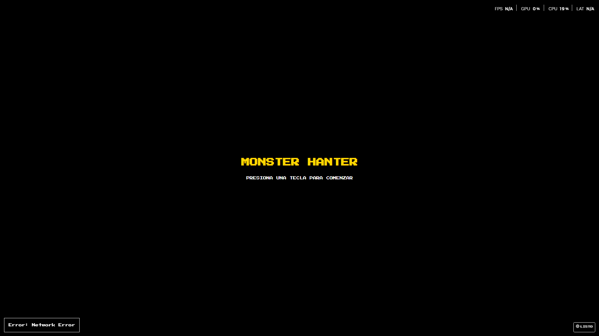
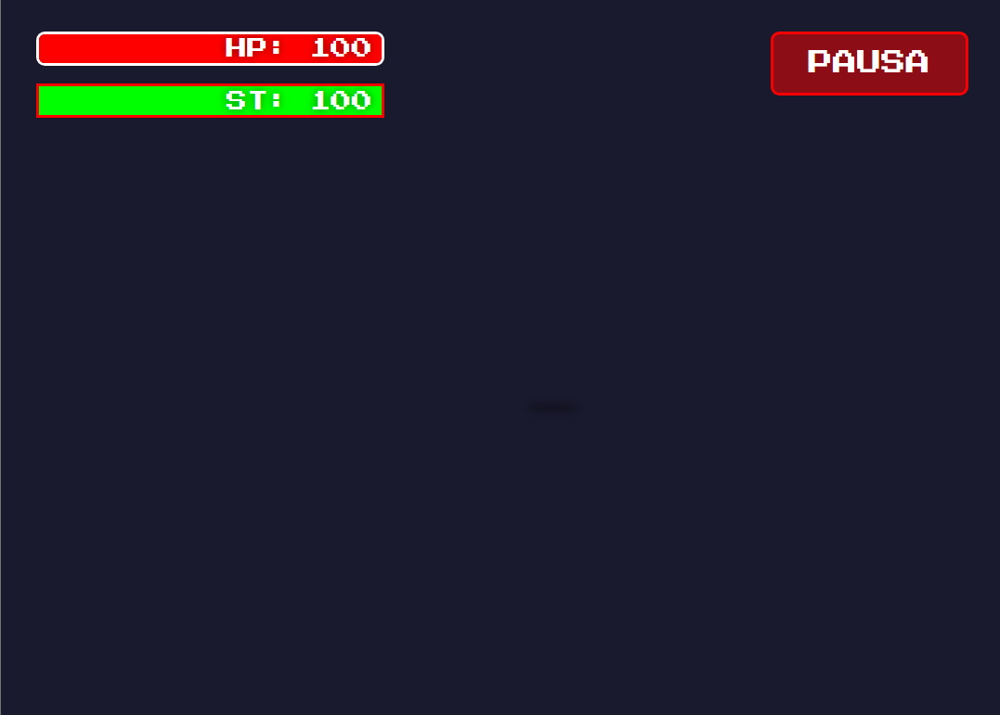

# MonsterHanter - Juego de Caza de Monstruos


## Descripción



MonsterHanter es un juego de caza de monstruos con estilo retro 8 bits, donde los jugadores pueden crear su personaje, seleccionar armas y embarcarse en emocionantes cacerías.

## Características
- Sistema de combate por turnos
- Diseño retro 8 bits
- Clima dinámico
- Personalización de personaje
- Sistema de crafting
- Sistema de inventario
- Sistema de misiones
- Efectos de estado
- Sistema de sonido

## Tecnologías Utilizadas
- React 18
- React Router DOM
- Styled Components
- Framer Motion
- Vite

## Instalación
1. Clona el repositorio
2. Instala las dependencias:
   ```bash
   npm install
   ```
3. Inicia el servidor de desarrollo:
   ```bash
   npm run dev
   ```

## Estructura del Proyecto
```
client/
  ├── src/
  │   ├── components/
  │   ├── styles/
  │   └── App.jsx
  ├── public/
  └── package.json
```

## Controles
- Flechas: Navegación
- Enter: Seleccionar
- Espacio: Atacar
- Shift: Defender

## Estado del Proyecto
- [x] Pantalla de inicio
- [x] Menú principal
- [x] Creación de personaje
- [x] Sistema de combate
- [x] Sistema de progresión
- [x] Sistema de inventario
- [x] Sistema de misiones
- [x] Sistema de crafting
- [x] Sistema de clima
- [x] Sistema de estados alterados
- [x] Sistema de sonido

## Próximas Características
- Sistema de multijugador
- Sistema de logros
- Guardado en la nube
- Más tipos de monstruos
- Sistema de temporadas

## Contribuciones
Las contribuciones son bienvenidas. Por favor, abre un issue para discutir los cambios propuestos.

## Licencia
Este proyecto está bajo la Licencia MIT.

## 🎯 Características Principales

- 🎮 Interfaz en estilo 8-bit con pixel art retro
- ⚔️ 14 armas diferentes con combos únicos y mecánicas especiales
- 🐉 Dragones y monstruos con patrones de ataque únicos y comportamientos dinámicos
- 🌍 Mundo abierto explorable con diferentes biomas y secretos
- 📈 Sistema de experiencia y nivelado con árbol de talentos
- 👤 Personalización completa del personaje y equipo
- 💾 Guardado automático de progreso en la nube
- 🎵 Banda sonora original inspirada en juegos retro
- 🎨 Arte pixel art original y animaciones fluidas
- 🌐 Modo multijugador cooperativo (próximamente)

## 🛠️ Requisitos Previos

- Node.js (v14 o superior)
- MongoDB (v5.0 o superior)
- npm (v6 o superior) o yarn (v1.22 o superior)

## 🚀 Instalación

1. Clona el repositorio:
```bash
git clone https://github.com/hectorflores28/reactjs-monster-hanter.git
cd reactjs-monster-hanter
```

2. Instala las dependencias:
```bash
npm run install-all
```

3. Configura las variables de entorno:
Crea un archivo `.env` en la raíz del proyecto:
```env
MONGODB_URI=tu_uri_de_mongodb
JWT_SECRET=tu_secreto_jwt
PORT=5000
NODE_ENV=development
```

4. Inicia el servidor de desarrollo:
```bash
npm run dev
```

El frontend estará disponible en `http://localhost:3000` y el backend en `http://localhost:5000`.

## 📁 Estructura del Proyecto

```
reactjs-monster-hanter/
├── client/                 # Frontend React
│   ├── src/
│   │   ├── components/    # Componentes React reutilizables
│   │   ├── assets/       # Recursos (imágenes, sonidos, sprites)
│   │   ├── contexts/     # Contextos de React para estado global
│   │   ├── hooks/        # Hooks personalizados
│   │   ├── pages/        # Páginas y rutas de la aplicación
│   │   └── utils/        # Utilidades y helpers
│   └── public/           # Archivos estáticos
├── server/               # Backend Node.js
│   ├── config/          # Configuraciones y variables de entorno
│   ├── controllers/     # Controladores de la API
│   ├── models/         # Modelos de MongoDB
│   ├── routes/         # Rutas y endpoints de la API
│   └── middleware/     # Middleware personalizado
└── package.json
```

## 🛡️ Tecnologías Utilizadas

### Frontend
- React.js 18
- Vite para desarrollo rápido
- Styled Components para estilos
- React Router v6 para navegación
- Context API para gestión de estado
- Framer Motion para animaciones
- Howler.js para audio

### Backend
- Node.js con Express
- MongoDB con Mongoose
- JWT para autenticación segura
- Socket.io para comunicación en tiempo real
- Jest para testing
- ESLint y Prettier para código limpio

## 🤝 Contribución

Las contribuciones son bienvenidas. Por favor, sigue estos pasos:

1. Haz fork del repositorio
2. Crea una rama para tu feature (`git checkout -b feature/AmazingFeature`)
3. Commit tus cambios (`git commit -m 'Add some AmazingFeature'`)
4. Push a la rama (`git push origin feature/AmazingFeature`)
5. Abre un Pull Request

## 📝 Licencia

Este proyecto está bajo la Licencia MIT - ver el archivo [LICENSE](LICENSE) para más detalles.

## 🙏 Agradecimientos

- Inspirado en Monster Hunter de Capcom
- Arte inspirado en Pokémon Platino y The Legend of Zelda GBA
- Comunidad de desarrolladores de juegos retro

## 📞 Contacto

Tu Nombre - [@hectorflores28](https://twitter.com/hectorflores28) - hectoralejandro_1@live.com.mx

Link del Proyecto: [https://github.com/hectorflores28/reactjs-monster-hanter](https://github.com/hectorflores28/reactjs-monster-hanter)
